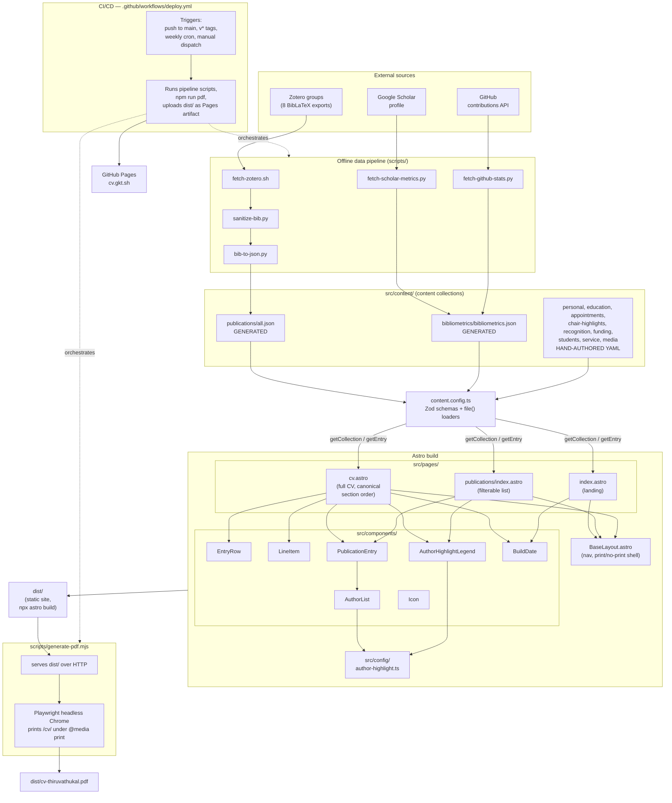

# Architecture

Component/interaction diagram for the CV site. See `README.md` for the prose walkthrough of the data pipeline and commands — this doc focuses on how the pieces fit together.

The system has three distinct runtime contexts, easy to conflate but worth keeping separate: an **offline data pipeline** (runs on demand or in CI, never in the browser), an **Astro build** (turns content + code into static HTML), and **CI/CD + hosting** (what actually runs the pipeline and build, and serves the result).

## Walkthrough

**Pipeline** (`scripts/`, gitignored outputs, re-run on demand or by CI): `fetch-zotero.sh` pulls raw BibLaTeX per Zotero group, `sanitize-bib.py` promotes `tex.*` Extra-field annotations (like `author+an`) to top-level fields, and `bib-to-json.py` merges everything into `src/content/publications/all.json` — parsing per-author roles along the way (see `AuthorList.astro` below). `fetch-scholar-metrics.py` and `fetch-github-stats.py` independently populate `src/content/bibliometrics/bibliometrics.json`. None of this runs at request time; it's a build-time data refresh.

**Content layer** (`src/content.config.ts`): the single ingestion boundary. Every page reads through `getCollection()`/`getEntry()` against Zod-typed collections — generated JSON and hand-authored YAML are indistinguishable to a page once they're through this layer. This is also where the `order`-field sorting requirement lives (see `AGENTS.md` rule 2).

**Pages + components** (`src/pages/`, `src/components/`): three pages share one `BaseLayout.astro` shell. `cv.astro` is the canonical, most section-complete page (also the PDF print target); `publications/index.astro` is a filtered subset with client-side JS for the type filter; `index.astro` is a landing page with headline stats. Shared rendering logic (`EntryRow`, `LineItem`, `PublicationEntry`) keeps section markup consistent; `AuthorList.astro` and `AuthorHighlightLegend.astro` both read their styling from `src/config/author-highlight.ts`, the single place to change how co-author roles are highlighted.

**Build output + PDF**: `astro build` produces static `dist/`. `scripts/generate-pdf.mjs` then serves that same `dist/` and has Playwright screenshot the `/cv/` route under print media to `dist/cv-thiruvathukal.pdf` — one layout, two outputs. `npm run pdf` runs both steps; a bare `astro build` afterward would wipe the PDF (see `AGENTS.md` rule 7).

**CI/CD + hosting**: `.github/workflows/deploy.yml` is the only place all of the above actually gets chained end-to-end — it re-runs the full pipeline, then `npm run pdf`, then deploys `dist/` to GitHub Pages. It fires on pushes to `main`, on `v*` tag pushes, weekly (to pick up upstream data changes with no code change), and on manual dispatch. The live site is `cv.gkt.sh`, a GitHub Pages custom domain.
